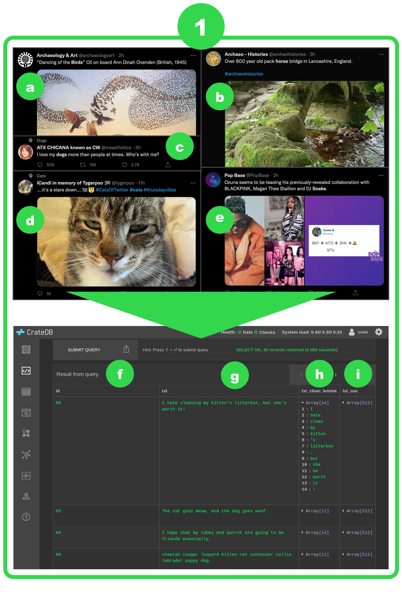

# ADaPT-ML

A Data Programming Template for Machine Learning

## Installation and Usage Guidelines ##

Follow these guidelines to set up ADaPT-ML on your machine and to see how you can add new classification tasks to the system. 

Before getting started, please make sure you are familiar with the following:
- [Docker](https://docs.docker.com/) and [Docker Compose](https://docs.docker.com/compose/)
  - working with environment variables, volumes, Dockerfiles, and the main docker-compose commands
- [Pandas](https://pandas.pydata.org/)
  - DataFrames
- [Label Studio v1.0](https://labelstud.io/)
  - Labeling Config files
- [Snorkel v0.9.7](https://www.snorkel.org/get-started/)
  - writing Labeling Functions, Label Matrix, Label Model
- [MLflow v1.19.0](https://mlflow.org/)
  - MLflow Projects, MLflow Tracking, MLflow Models, Model Registry
- [FastAPI v0.68.1](https://fastapi.tiangolo.com/)
  - endpoints, Pydantic, requests, JSON

Now that you are familiar with the concepts, terminology, and tools that make up ADaPT-ML, let's get started!

### Step 1: Installing Docker and Docker Compose ###
Docker and Docker Compose are required to use ADaPT-ML. Please follow the links for each and review the installation instructions, and make sure that they are installed on the host machine where you will be cloning this repository to.

### Step 2: Setting up the environment variables for Docker Compose ###
Create a `.env` file in the repository's root directory with the environment variables listed below or add them to the host machine's environment variable list, and define these variables based off of the description listed for each one:
```shell
# The root directory for storing all Label Studio projects (including tasks and exported annotations) and all data programming / modelling artifacts and experiment runs (was set to ./example_data for the example use case).
DATA_PATH=

# The root directory for CrateDB (was set to ./crate for the example use case). If your SQLAlchemy database is stored on a remote server, then you can ignore this and delete the cratedb service from docker-compose.yml. If you want your database to be set up remotely but have not created it yet, then you can extract the cratedb service from docker-compose.yml and use it to set CrateDB up on the remote server and set this variable.
DB_DATA_PATH=

# Feel free to rename the Label Studio directory, but remember to change it in docker-compose.yml if you do.
LS_PATH=${DATA_PATH}/ls

# Feel free to rename the Label Studio data directory, but remember to change it in docker-compose.yml if you do.
LS_DATA_PATH=${LS_PATH}/data

# Feel free to rename the Label Studio tasks directory, but remember to change it in docker-compose.yml if you do.
LS_TASKS_PATH=${LS_PATH}/tasks

# Feel free to rename the Label Studio annotations directory, but remember to change it in docker-compose.yml if you do.
LS_ANNOTATIONS_PATH=${LS_PATH}/annotations

# Feel free to rename the data programming directory, but remember to change it in docker-compose.yml if you do.
DP_DATA_PATH=${DATA_PATH}/dp

# Feel free to rename the modelling directory, but remember to change it in docker-compose.yml if you do.
MODELLING_DATA_PATH=${DATA_PATH}/m

# If your CrateDB database is stored on a remote server, then change crate-db to the IP address of the host machine. If your database is supported by SQLAlchemy but is not specifically CrateDB, then refer to [2] at the bottom of this README.
DATABASE_IP=crate://crate-db:4200

# Feel free to rename the data programming MLflow database, or leave it as-is.
DP_MYSQL_DATABASE=mlruns.db

# Set the following username, password, and root password variables to your preferences.
DP_MYSQL_USER=
DP_MYSQL_PASSWORD=
DP_MYSQL_ROOT_PASSWORD=

# Leave these variables as-is.
DP_HOST_NAME=dp-mlflow-db
DP_MLFLOW_TRACKING_URI=mysql+pymysql://${DP_MYSQL_USER}:${DP_MYSQL_PASSWORD}@${DP_HOST_NAME}:3306/${DP_MYSQL_DATABASE}

# Feel free to rename the modelling MLflow database, or leave it as-is.
MODELLING_MYSQL_DATABASE=mlruns.db

# Set the following username, password, and root password variables to your preferences.
MODELLING_MYSQL_USER=
MODELLING_MYSQL_PASSWORD=
MODELLING_MYSQL_ROOT_PASSWORD=

# Leave these variables as-is.
MODELLING_HOST_NAME=modelling-mlflow-db
MODELLING_MLFLOW_TRACKING_URI=mysql+pymysql://${MODELLING_MYSQL_USER}:${MODELLING_MYSQL_PASSWORD}@${MODELLING_HOST_NAME}:3306/${MODELLING_MYSQL_DATABASE}

# If you want to run through the example use case, then leave these variables as-is and make sure that DATA_PATH and DB_DATA_PATH are set to ./example_data and ./crate respectively. Otherwise, these variables are not required to be set. Once you have a model of your own ready to be deployed, set these according to the path to the python_model.pkl artifact displayed in MLflow (see [3])
MULTICLASS_EXAMPLE_MODEL_PATH=/mlruns/multiclass_model.pkl
MULTILABEL_EXAMPLE_MODEL_PATH=/mlruns/multilabel_model.pkl
```

### Step 3: Changes to [label-studio](./label-studio) ###

Most of the setup for Label Studio is done through the UI that is launched at http://localhost:8080 by default when you run either the `dev` or `label` profile for docker compose, but there are a few things within this project directory to take note of, especially if you plan on using Label Studio's API.

#### [Format your Labeling Config file](./label-studio/config/example_config.xml) ####

This configures how each component of a datapoint will be displayed to the annotators. This file can be copied and pasted into the Label Studio Labeling Configuration UI, or set for a certain project [using the API](https://labelstud.io/api#operation/api_projects_create).

#### [Define your classification task name and classes](./label-studio/ls/__init__.py) ####

Until there is one configuration file for defining the classification task name and classes across all steps in the ADaPT-ML pipeline (see [Contributing](#community-guidelines)), you will need to update the `CLASSIFICATION_TASKS` variable with your new task name and corresponding classes.

#### Please note: ####

The Example Use Case demonstrates how to add a new classification task with only a text component for each datapoint. Therefore, it may be necessary to make changes to the [task sampling](./label-studio/ls/sample_tasks.py), [annotation processing](./label-studio/ls/process_annotations.py), and/or [annotator agreement](./label-studio/ls/annotator_agreement.py) modules if Label Studio's JSON import and export format is different according to the datapoint's number of components (e.g. both text and image), number of annotators, etc. See [Contributing](#community-guidelines).

### Step 4: Changes to [data-programming](./data-programming) ###

Setting up the data-programming project within ADaPT-ML to work with a new classification task requires adding new Python modules and editing some existing files. You can follow along with the Example Use Case to get an overview, but the details are as follows, file-by-file:

#### [Define your class names](./data-programming/label/lfs/__init__.py) ####

Until there is one configuration file for defining the classification task name and classes across all steps in the ADaPT-ML pipeline (see [Contributing](#community-guidelines)), this is where you need to define the Class that will hold both the name of each class and the number representing that class, which the Labeling Functions will use to vote, and which will ultimately make up the Label Matrix. **NOTE**: if your task is specifically a **binary** task, then you need to use the suffix `_pos` for the positive class (and optionally `_neg` for the negative class) in order to have the correct binary classification metrics downstream.

#### [Write your Labeling Functions](./data-programming/label/lfs/example.py) ####

This module that you can name after your new classification task is where you will write your Labeling Functions, and create a function called `get_lfs` that will produce an iterable containing all of the Labeling Functions you have defined.

#### [Create your main function as an MLflow endpoint](./data-programming/label/example.py) ####

This is the main module for your new task. You will need to import the Class you defined in [this step](#define-your-class-namesdata-programminglabellfs__init__py) and the `get_lfs` function defined in [this step](#write-your-labeling-functionsdata-programminglabellfsyour_new_taskpy). You will also need to create a name for the Label Model that will be specific to your new task, and a dictionary with the names of the columns holding the features extracted for use with the Labeling Functions you defined as keys and any functions necessary to properly transform or unpack the featurized data point as values. You will also need to specify the path within the Label Studio annotations directory to the DataFrame that holds the annotated development data. Another optional argument is whether or not you want to apply the Labeling Functions in sequence or in parallel -- supply this argument if you find that it takes too long to create the Label Matrix.

#### [Add your MLflow endpoint to the MLproject file](./data-programming/MLproject) ####

This file is where you will specify the default hyperparameters for training the Label Model, the type of classification your new task falls under (multiclass or multilabel), and the path to the main module you created in [this step](#create-your-main-function-as-an-mlflow-endpointdata-programminglabelexamplepy). If you perform hyperparameter tuning and find a configuration that works well for your task, then change the defaults here!

### Step 5: Changes to [modelling](./modelling) (including model deployment) ###

There is not much that you have to edit in this project directory unless you need a machine learning algorithm other than a multilayer perceptron (MLP), but if you do add a new algorithm, please see [Contributing](#community-guidelines)! For now, all of the edits are to the FastAPI app.

#### [Add your class response format and endpoint to the deployment app](./modelling/app/main.py) ####

Until there is one configuration file for defining the classification task name and classes across all steps in the ADaPT-ML pipeline (see [Contributing](#community-guidelines)), you will need to add a response model that validates the output from your prediction endpoint. You will also need to create and set environment variables in [this step](#setting-up-the-environment-variables-for-docker-compose) for your new End Model and add functions to load them. You can add an element to the `loaded_models_dict` for your model, so you will know if it loaded successfully by visiting the root page. Finally, you will need to add an endpoint to get predictions for new datapoints from your model.

### Step 6: Starting ADaPT-ML ###

Once you have your new classification task ready to go by completing Steps 1-5, all you need to do is:
```shell
cd ADaPT-ML/
docker-compose --profile dev up -d
docker-compose ps
```
Once you see Docker Compose report this:
```shell
         Name                        Command                  State                                  Ports                            
--------------------------------------------------------------------------------------------------------------------------------------
crate-db                  /docker-entrypoint.sh crat ...   Up             0.0.0.0:4200->4200/tcp,:::4200->4200/tcp, 4300/tcp, 5432/tcp
dp-mlflow                 /bin/bash                        Up                                                                         
dp-mlflow-db              /entrypoint.sh mysqld            Up (healthy)   3306/tcp, 33060/tcp, 33061/tcp                              
dp-mlflow-server          mlflow server --backend-st ...   Up             0.0.0.0:5000->5000/tcp,:::5000->5000/tcp                    
label-studio-dev          /bin/bash                        Up                                                                         
label-studio-web          ./deploy/docker-entrypoint ...   Up             0.0.0.0:8080->8080/tcp,:::8080->8080/tcp                    
modelling-mlflow          /bin/bash                        Up                                                                         
modelling-mlflow-db       /entrypoint.sh mysqld            Up (healthy)   3306/tcp, 33060/tcp, 33061/tcp                              
modelling-mlflow-deploy   /start.sh                        Up             0.0.0.0:80->80/tcp,:::80->80/tcp                            
modelling-mlflow-server   mlflow server --backend-st ...   Up             0.0.0.0:5001->5000/tcp,:::5001->5000/tcp 
```
Then it's ready! Import your data into a table in CrateDB and refer to the [Example Usage](#example-usage) for an example of how to manipulate the data so that it's ready for ADaPT-ML. How you load the data, featurize it, and sample from it to create your unlabeled training data is up to you -- ADaPT-ML does not perform these tasks. However, there may be an opportunity for certain sampling methods to become a part of the system; see [Contributing](#community-guidelines).

### Step 7: Run a data programming experiment ###

Once you have determined how you will sample some of your data for training an End Model, you need to save it as a pickled Pandas DataFrame with columns `id` and `table`, and optionally other columns if you need them. `table` needs to have the name of the table in CrateDB where the datapoint is stored. Once this DataFrame is in the directory `$DP_DATA_PATH/unlabeled_data`, you can run this command to label your data:
```shell
docker exec dp-mlflow sh -c ". ~/.bashrc && wait-for-it dp-mlflow-db:3306 -s -- mlflow run --no-conda -e ENTRYPOINT --experiment-name EXP_NAME -P train_data=/unlabeled_data/[DATA].pkl -P task=[TASK] ."
```
where `ENTRYPOINT` is the name of the entrypoint you specified in [this step](#add-your-mlflow-endpoint-to-the-mlproject-filedata-programmingmlproject), `EXP_NAME` is a name for the experiment of your choosing, `DATA` is the name of the Pandas DataFrame holding your unlabeled data, and `TASK` is the type of classification that is appropriate for your new task (multiclass or multilabel). You can then check http://localhost:5000 to access the MLflow UI and see the experiment log, Labeling Function evaluation, artifacts, metrics, and more. Your labeled data will be stored in the directory `$DP_DATA_PATH/mlruns/EXP_ID/RUN_ID/artifacts/training_data.pkl` where `EXP_ID` is the id corresponding to `EXP_NAME`, and `RUN_ID` is a unique id created by MLflow for the run.

### Step 8: Run a modelling experiment ###

Once you have run some experiments and are happy with the resulting labeled data, you can split this data into training and testing datasets according to a method of your choosing. You have probably noticed that up until this point, Label Studio has not actually been used; if you do have annotators who can manually label a sample of data, then you may choose to use this sample as your test set. Otherwise, if you want to externally validate the model later, then you can use the data that Label Studio labeled as your test data. Whatever you choose, make sure that you have placed `training_data.pkl` in `$MODELLING_DATA_PATH/train_data/` and your test data in `$MODELLING_DATA_PATH/test_data/`. Then you can run this command to train and evaluate an MLP model:
```shell
docker exec modelling-mlflow sh -c ". ~/.bashrc && wait-for-it modelling-mlflow-db:3306 -s -- mlflow run --no-conda -e mlp --experiment-name EXP_NAME -P train_data=/train_data/[TRAIN_DATA].pkl -P test_data=/train_data/[TEST_DATA].pkl -P features=[FEATURE] ."
```
where `EXP_NAME` is a name for the experiment of your choosing, `TRAIN_DATA` is the name of the Pandas DataFrame holding your training data, `TEST_DATA` is the name of the Pandas DataFrame holding your testing data, and `FEATURE` is a list of column names holding the feature vectors in CrateDB. You can then check http://localhost:5001 to access the MLflow UI and see the experiment log, artifacts, metrics, and more. Take note of the path to your trained End Model, and if you are satisfied with its performance, you can update your End Model's [environment variable](#step-2-setting-up-the-environment-variables-for-docker-compose) to this path.

### Step 9: Deploying your model ###

Once you have an End Model that is performant, and you have specified the path to it, you can reload the deployment API by running these commands:
```shell
docker-compose stop
docker-compose --profile dev up -d
```
and visit http://localhost:80/docs to see the deployment API. You can use this API to get predictions on unseen datapoints, and then determine a method to load the JSON response into your data table in CrateDB. You now have classified your data and can perform any downstream analyses you need!

## Example Usage ##

Our Example Use Case is to develop a model that can predict whether a data point is about a cat, dog, bird, horse, or snake. Although intuitively this is purely a multilabel task where it is reasonable to assume that multiple animals could be mentioned in one datapoint, this task has been divided into a multiclass setting, where there is only one possible class that the data point can belong to, and a multilabel setting, where one data point can belong to one or many classes, to demonstrate how to handle both tasks (it is not necessary for you to also divide your new classification task into multiclass and multilabel settings). 

We do not have an existing annotated dataset for this classification task, so the first step will be to create one. When you first get started, you will need to gather the appropriate data for your task, and featurize it in two ways:
1. Decide on which features you would pull out to assist in annotation if you were going to manually assign classes to the datapoints.
2. Decide on how you would represent the datapoints as feature vectors for the End Model.
Again, to keep it simple for this use case, our first feature set is simply lemmatized tokens. Our second feature set is the output from the Universal Sentence Encoder, given the raw text as input.

In this use case, I manually created data points with only a text component to keep it simple, but consider the tweets **1a**-**1e** in the diagram below. Many of them have both text and images that can provide information for more accurate classification. Let's run through each datapoint:
- **1a** has a textual component with the keyword "Birds", and an image component that is a painting where birds can be identified.
- **1b** has a textual component with the keyword "horse", and an image component that does not on its own provide information that it is related to horses.
- **1c** only has a textual component with the keyword "dogs".
- **1d** has a reference to cats in its textual component with a :pouting_cat: emoji and hashtags. Its image component is an obvious picture of a cat.
- **1e** has a textual component that has the keyword "snake", but it is actually not about the animal. The image component does not on its own provide information that is related to snakes.



This diagram demonstrates the process of setting up the example use case data in a table in CrateDB so that it is ready for ADaPT-ML:
- column **1f** has the _essential_ `id` column: your data table must have this column to work with ADaPT-ML. It can be any combination of numbers and letters.
- column **1g** has the unprocessed, raw text component of each datapoint. Note the column name `txt`: this is the column used in Label Studio for annotation, so this name appears three times in the [Labeling Config file](./label-studio/config/example_config.xml): in `<Text name="txt" value="$txt"/>` and `<Choices name="topic" toName="txt" choice="multiple" showInLine="false">`
- column **1h** has the first featurization step -- features that will be used by the Labeling Functions. Note the column name `txt_clean_lemma`: this column name is specified in our [data programming MLflow endpoint](./data-programming/label/example.py) for this example task, with no loader function: `LF_FEATURES = {'txt_clean_lemma': None}`. For this use case, as mentioned before, our Labeling Functions will have access to the text in 1g that has been lemmatized. Consider, though, a more rich set of features for the text component such as word embeddings, emoji normalization, hashtag splitting, and so on. If our datapoint had an image component, then we could pull out features such as the prediction from an image classifier that has been trained on one or more categories included in our task, the output from an image classifier that can detect language embedded within the image, and so on. The output from all of these different featurization methods would be held in different columns in this table.
- column **1i** has the second featurization step -- features that will be used to train and get predictions from the End Model. For this use case, we have put the text in 1g through the Universal Sentence Encoder to obtain a semantic representation of the text. As in the first featurization step, you can create multiple feature vectors for the datapoint's different components, and ADaPT-ML will concatenate these vectors in the order given, not necessarily the order it appears in the table.

As long as each table has these essential columns, you can combine multiple tables to create your training and testing data.
## Community Guidelines ##

Follow these guidelines to see where you can contribute new modules to expand the system's functionality and adaptability. The following items are on ADaPT-ML's "wish list":


## Additional Installation Notes: ##
If you want to use CrateDB on your host machine but are experiencing issues, please go through these bootstrap checks,
as the host system must be configured correctly to use CrateDB with Docker.

https://crate.io/docs/crate/howtos/en/latest/admin/bootstrap-checks.html
https://pandas.pydata.org/pandas-docs/stable/reference/api/pandas.DataFrame.to_sql.html