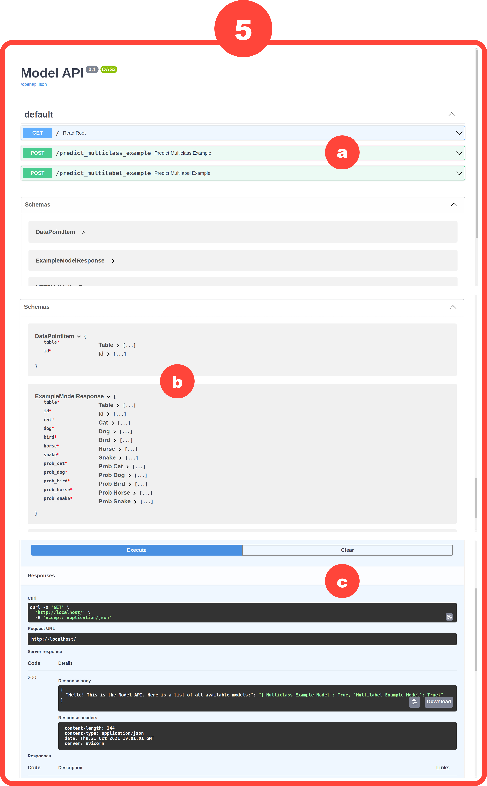

[](https://joss.theoj.org/papers/e846e08311cee3886d33101209166f4c)

# ADaPT-ML #
## A Data Programming Template for Machine Learning ##

Often when studying natural phenomena by creating data-driven models, processing the data becomes the largest challenge. Without a framework to build upon and implement one's ideas, researchers are forced to hastily build inflexible programs from the ground up. When hypotheses need to be reworked or modelling a new aspect of the phenomena becomes necessary, even more time is spent on the program before finally being able to test out new ideas. This inherently causes problems, with additional problems arising such as including internal and external validation steps as an afterthought rather than a checkstop in the pipeline.

ADaPT-ML aims to be the flexible framework upon which researchers can implement their understanding of the phenomena under study. This software was created especially for any researcher with:

* Some programming experience or interest in learning how to write code based off of examples. 

* Access to large amounts of unlabeled data that is constantly changing, such as social media data. 

* Domain expertise or an intuition about how they would follow rules, heuristics, or use knowledge bases to annotate the unlabeled data. 

ADaPT-ML takes as much of the development work as possible out of creating novel models of phenomenon for which we have well-developed theories that have yet to be applied to big data.

## Introduction ##

ADaPT-ML is composed of a number of open-source tools and libraries, as shown in this system diagram. To familiarize yourself with these components, please review the tools and libraries linked to below the diagram.


- [Docker](https://docs.docker.com/) and [Docker Compose](https://docs.docker.com/compose/)
  - working with environment variables, volumes, Dockerfiles, and the main docker-compose commands
- [Pandas](https://pandas.pydata.org/)
  - DataFrames
- [Label Studio v1.0](https://labelstud.io/)
  - Labeling Config files
- [Snorkel v0.9.7](https://www.snorkel.org/get-started/)
  - writing Labeling Functions, Label Matrix, Label Model
- [MLflow v1.19.0](https://mlflow.org/)
  - MLflow Projects, MLflow Tracking, MLflow Models, Model Registry
- [FastAPI v0.68.1](https://fastapi.tiangolo.com/)
  - endpoints, Pydantic, requests, JSON

Now that you are familiar with the concepts, terminology, and tools that make up ADaPT-ML, let's look at the example use case included in this repository. Once you have an understanding of how ADaPT-ML works and want to get started with your own use case, please refer to these instructions for [testing](test/README.md) ADaPT-ML on your machine, and the [usage guidelines](./usage.md), including how to contribute to this project.

## Example Usage ##

Our Example Use Case is to develop a model that can predict whether a data point is about a cat, dog, bird, horse, or snake. Although intuitively this is purely a multilabel task where it is reasonable to assume that one or more animals could be mentioned in one datapoint, this task has been divided into a multiclass setting, where there is only one possible class that the data point can belong to, and a multilabel setting, where one data point can belong to one or many classes, to demonstrate how to handle both tasks (it is not necessary for you to also divide your new classification task into multiclass and multilabel settings). 

All of the directories and files mentioned in the following steps exist in the locations specified in the `.env` file of this repository. To follow along using the various UIs, complete [Step 1](usage.md#step-1-review-system-requirements) and these [tests](test/README.md) to get ADaPT-ML running on your host machine, and go to the following addresses in your web browser of choice:
1. `localhost:4200` for CrateDB
2. `localhost:8080` for Label Studio
3. `localhost:5000` for data programming MLflow
4. `localhost:5001` for modelling MLflow
5. `localhost:81/docs` for FastAPI

### Step 1: obtain and featurize some data ###

We do not have an existing annotated dataset for this classification task, so the first step will be to create one. When you first get started, you will need to gather the appropriate data for your task, and featurize it in two ways:
1. Decide on which features you would pull out to assist in annotation if you were going to manually assign classes to the datapoints.
2. Decide on how you would represent the datapoints as feature vectors for the End Model.
Again, to keep it simple for this use case, our first feature set is simply lemmatized tokens. Our second feature set is the output from the Universal Sentence Encoder, given the raw text as input.

In this use case, data points were manually created with only a text component to keep it simple, but consider the tweets **1a**-**1e** in the diagram below. 


Many of them have both text and images that can provide information for more accurate classification. Let's run through each datapoint:
- **1a** has a textual component with the keyword "Birds", and an image component that is a painting where birds can be identified.
- **1b** has a textual component with the keyword "horse", and an image component that does not on its own provide information that it is related to horses.
- **1c** only has a textual component with the keyword "dogs".
- **1d** has a reference to cats in its textual component with a :pouting_cat: emoji and hashtags. Its image component is an obvious picture of a cat.
- **1e** has a textual component that has the keyword "snake", but it is actually not about the animal. The image component does not on its own provide information that is related to snakes.

This diagram demonstrates the process of setting up the example use case data in a table in CrateDB so that it is ready for ADaPT-ML. As long as each table has these essential columns, you can combine multiple tables to create your training and testing data:
- column **1f** is the _essential_ `id` column: your data table must have this column to work with ADaPT-ML. It can be any combination of numbers and letters.
- column **1g** has the unprocessed, raw text component of each datapoint. Note the column name `txt`: this is the column used in Label Studio for annotation, so this name appears in the [Labeling Config file](./label-studio/config/example_config.xml): in `<Text name="txt" value="$txt"/>` and `<Choices name="topic" toName="txt" choice="multiple" showInLine="false">`
- column **1h** has the first featurization step -- features that will be used by the Labeling Functions. Note the column name `txt_clean_lemma`: this column name is specified in our [data programming MLflow endpoint](./data-programming/label/example.py) for this example task, with no loader function: `LF_FEATURES = {'txt_clean_lemma': None}`. For this use case, as mentioned before, our Labeling Functions will have access to the text in _1g_ that has been lemmatized. Consider, though, a more rich set of features for the text component such as word embeddings, emoji normalization, hashtag splitting, and so on. If our datapoint had an image component, then we could pull out features such as the prediction from an image classifier that has been trained on one or more categories included in our task, the output from an image classifier that can detect language embedded within the image, and so on. The output from all of these different featurization methods would be held in different columns in this table.
- column **1i** has the second featurization step -- features that will be used to train and get predictions from the End Model. For this use case, we have put the text in _1g_ through the Universal Sentence Encoder to obtain a semantic representation of the text. Unlike the first featurization step, these feature columns can _only be real-number vectors_. You can create multiple feature vectors for the datapoint's different components, and ADaPT-ML will concatenate these vectors in the order given, not necessarily the order it appears in the table. 

### Step 2: create a gold dataset using Label Studio ###

We are now ready to annotate a sample of data in Label Studio! Because we only have a total of 15 datapoints for the multiclass setting and 15 for the multilabel setting, they were all annotated manually, but in a real-world application of this classification task, it is likely we would have hundreds of thousands of datapoints. In this case, we would instruct two or more annotators to manually label a few hundred datapoints for a few purposes:
1. Gather feedback from the annotators to inform how we can update or create new Labeling Functions
2. Estimate the class balance and make it available to the Label Model during training
3. Perform an empirical evaluation of the Labeling Functions and Label Model
4. Validate the End Model

The first step to annotate data using Label Studio is to set up the project using the Label Studio UI. For this example use case, we enter `localhost:8080` (if you changed the port in `docker-compose.yml`, replace `8080` with what you entered) in a web browser. Create an account, and set up the project (we simply called it "example").

The second step is to sample some data from CrateDB. The sampling method implemented currently in ADaPT-ML is a random N, so this commannd was used to sample all 30 datapoints for the multiclass and multilabel settings:
```shell
docker exec label-studio-dev python ./ls/sample_tasks.py example_data txt 30 example --filename example_tasks.json
```
This module will format the data in the column names provided so that it can be read by Label Studio, and save a file in the `$LS_TASKS_PATH` directory. The diagram below shows the process of using Label Studio to import the sampled data, annotate it, and export it.


- **2a** shows all the created projects, allowing for multiple classification problems. 
- **2b** has the popup for importing our `example_tasks.json` file.
- **2c** shows the imported tasks, which can be clicked on to arrive at the labeling page.
- **2d** is the main labeling interface determined by the [example config file](label-studio/config/example_config.xml), with different tabs for multiple annotators.
- **2e** once annotation is complete, they are exported in JSON format to the host machine's Downloads folder by default. For this demonstration, they were manually moved and renamed to `$LS_ANNOTATIONS_PATH/annotations/example_annotations.json`

Now that we have labeled all of our sample data and exported the results, we need to process the JSON file back into the Pandas DataFrames that ADaPT-ML can use. Because we had multiple annotators label each datapoint, we need to decide how we want to compile these labels into one gold label set. These two tasks are accomplished through this command:
```shell
docker exec label-studio-dev python ./ls/process_annotations.py example_annotations.json example 1
```
The following DataFrames are saved in `$LS_ANNOTATIONS_PATH/example`:
- `ann_df.pkl` contains all of the datapoints that were initially exported from Label Studio with a column for each annotator's label set.
- `task_df.pkl` contains only the datapoints that were labeled by all annotators working on the project (e.g., if worker 1 labeled 50 datapoints and worker 2 labeled 45, then this DataFrame will contain 45 datapoints.)
- `gold_df.pkl` contains the final gold label set that was compiled according to the method selected using the `gold_choice` argument. In this case, worker_1's labels were selected.
Finally, before we use the gold labels, we need to check the level of agreement between the annotators. To do this, we use this command:

```shell
docker exec label-studio-dev python ./ls/annotator_agreement.py example
```
This module uses `task_df.pkl` to calculate Krippendorff's alpha. For demonstration purposes, worker_2 intentionally disagreed with worker_1 on several datapoints, where worker_1 made all correct choices. Between worker_1 and worker_2, the agreement report looks like this:
```
TASK: example
NOMINAL ALPHA: 0.43847133757961776
RESULT: 0.43847133757961776 < 0.667. Discard these annotations and start again. 
```
This would normally prompt an iteration on the labelling process, but we are choosing only worker_1's labels for the gold dataset.

### Step 3: use data programming to create a labeled dataset ###

Now that we have our gold labels, we are ready to perform data programming to label more data. We have followed [these instructions](./usage.md) to modify ADaPT-ML for our example classification task. We also sampled some data from CrateDB that we want to use as training data; for this example use case, we have one DataFrame with the multiclass datapoints and one DataFrame with the multilabel datapoints, and both DataFrames only have the columns `id` and `table_name`. The DataFrames are called `multiclass_df.pkl` and `multilabel_df.pkl`, and both are stored in `$DP_DATA_PATH/unlabeled_data`.

Once we run the commands in the following code block...
```shell
docker exec dp-mlflow sh -c ". ~/.bashrc && wait-for-it dp-mlflow-db:3306 -s -- mlflow run --no-conda -e example --experiment-name eg -P train_data=/unlabeled_data/multiclass_df.pkl -P dev_data=1 -P task=multiclass -P seed=8 ."

docker exec dp-mlflow sh -c ". ~/.bashrc && wait-for-it dp-mlflow-db:3306 -s -- mlflow run --no-conda -e example --experiment-name eg -P train_data=/unlabeled_data/multilabel_df.pkl -P dev_data=1 -P task=multilabel -P seed=8 ."
```
...we can check out the results using the MLflow UI, as seen in the diagram below. 


- **3a** shows the landing page for MLflow, where the Experiment ID (`EXP_ID`) is shown, and runs can be filtered and selected.
- **3b** has some metadata for the run, including the run command showing that default parameters were used. The Run ID (`RUN_ID`) is shown at the top of the page.
- **3c** shows the metrics available under the multilabel setting.
- **3d** the result of Labeling Function evaluation against the gold labels in the `gold_df` are seen in `lf_summary_dev.html`.
- **3e** `development_data.pkl` has the aforementioned columns in addition to the `gold_label` column from the `gold_df`.
- **3f** `training_data.pkl` has the Label Model's predicted labels in the column `label` and the probability distribution over all classes in the column `label_probs`.

Once we have experimented with the Label Model parameters, Labeling Functions, and datasets to our satisfaction, we can make note of the experiment ID (`EXP_ID`) and run ID (`RUN_ID`) to access the `training_data.pkl` and `development_data.pkl` that we want to use in End Model training and evaluation. For ease of demonstration, these artifacts have been placed in `${DP_DATA_PATH}/mlruns`, but normally these artifacts would be found in `${DP_DATA_PATH}/mlruns/EXP_ID/RUN_ID/artifacts`.

### Step 4: create an End Model ###

Now that we have our training data labeled by the Label Model and testing data with gold labels, we can create an End Model that, given a DataFrame containing only the `id` and `table_name` columns, will look up the appropriate features for each datapoint in CrateDB and produce a DataFrame with a binary encoding for the predicted class(es), and the probability distribution over all classes. Currently, ADaPT-ML only has one machine learning algorithm, [scikit-learn's Multi-layer Perceptron (MLP)](https://scikit-learn.org/stable/modules/generated/sklearn.neural_network.MLPClassifier.html), a classifier that optimizes the log-loss function using LBFGS or stochastic gradient descent.

After running the commands in this code block...
```shell
docker exec modelling-mlflow sh -c ". ~/.bashrc && wait-for-it modelling-mlflow-db:3306 -s -- mlflow run --no-conda -e mlp --experiment-name eg -P train_data=/dp_mlruns/multiclass_training_data.pkl -P test_data=/dp_mlruns/multiclass_development_data.pkl -P features=txt_use -P solver=lbfgs -P random_state=8 ."

docker exec modelling-mlflow sh -c ". ~/.bashrc && wait-for-it modelling-mlflow-db:3306 -s -- mlflow run --no-conda -e mlp --experiment-name eg -P train_data=/dp_mlruns/multilabel_training_data.pkl -P test_data=/dp_mlruns/multilabel_development_data.pkl -P features=txt_use -P solver=lbfgs -P random_state=8 ."
```
...we can check out the results in MLflow, as shown in the diagram below.


- **4a** shows all the training parameters for the MLP model, in addition to the specific features used for the given training data. Note that the `txt_use` parameter is the column 1i in the [diagram for Step 1](#step-1-obtain-and-featurize-some-data).
- **4b** if the test data has gold labels in addition to the Label Model's labels, then the model will be evaluated against both, and they will show up here with "GOLD" and "LM" prefixes. If there are no gold labels, then the metrics will only have "LM".
- **4c** is the confusion matrix for the gold labels and predicted labels in the multiclass setting.
- **4d** is the confusion matrix for the gold labels and predicted labels in the multilabel setting.
- **4e** is the DataFrame with the model's predicted label(s) and the probability distribution over all classes.

Once we have experimented with the MLP parameters, and possibly iterated more on the data programming step if necessary, we can prepare our models for deployment by simply updating the model environment variables in `.env` and the `environment` section of the `m_deploy` service in [docker-compose.yml](./docker-compose.yml) to point to `python_model.pkl`. For this example use case, multiclass and multilabel models were copied and renamed to `${MODELLING_DATA_PATH}/mlruns/multiclass_model.pkl` and `${MODELLING_DATA_PATH}/mlruns/multilabel_model.pkl`.

### Step 5: deploy the End Model ###

This diagram shows the FastAPI UI for the deployed models.



- **5a** on the landing page, we can see the endpoints for predicting multiclass and multilabel.
- **5b** below the endpoints is a schema of the expected format for posting data, and the data format that the model will return in response.
- **5c** this shows an example of how to use the UI to get the `curl` command for the endpoint, and what the response looks like.

Now we can get multiclass predictions...
```shell
curl -X 'POST' \
  'http://localhost/predict_multiclass_example' \
  -H 'accept: application/json' \
  -H 'Content-Type: application/json' \
  -d '{
  "table_name": [
    "example_data"
  ],
  "id": [
    "20"
  ]
}'
```
```
{
  "table_name": [
    "example_data"
  ],
  "id": [
    "20"
  ],
  "cat": [
    0
  ],
  "dog": [
    0
  ],
  "bird": [
    0
  ],
  "horse": [
    0
  ],
  "snake": [
    1
  ],
  "prob_cat": [
    5.6850715594352195e-8
  ],
  "prob_dog": [
    0.0001963686969921083
  ],
  "prob_bird": [
    8.922841061481865e-8
  ],
  "prob_horse": [
    8.82467128837139e-9
  ],
  "prob_snake": [
    0.9998034763992105
  ]
}
```
...and multilabel predictions...
```shell
curl -X 'POST' \
  'http://localhost/predict_multilabel_example' \
  -H 'accept: application/json' \
  -H 'Content-Type: application/json' \
  -d '{
  "table_name": [
    "example_data"
  ],
  "id": [
    "03"
  ]
}'
```
```
{
  "table_name": [
    "example_data"
  ],
  "id": [
    "03"
  ],
  "cat": [
    1
  ],
  "dog": [
    1
  ],
  "bird": [
    0
  ],
  "horse": [
    0
  ],
  "snake": [
    0
  ],
  "prob_cat": [
    0.999976879069893
  ],
  "prob_dog": [
    0.9999725147168369
  ],
  "prob_bird": [
    2.061596293323691e-8
  ],
  "prob_horse": [
    1.7205732529738035e-7
  ],
  "prob_snake": [
    2.0265644234853424e-8
  ]
}
```
...for any datapoint that has the `txt_use` feature set in CrateDB. We have successfully created a model for our new example use case!
